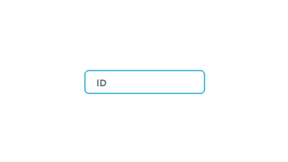

# inputBox Design

## 프로젝트 소개
CSS를 이용하여 input box 디자인

 

## 사용 언어
- HTML
- CSS

## 구현방법
- label을 input box의 가운데에 위치
- 포커스 시 label을 위로 이동 
- transition을 이용하여 자연스럽게 이동하도록 구현
- input box의 테두리와 겹치는 부분을 해결하기 위해 label의 bakground를 폼의 background색으로 지정
- 포커스 뿐만아니라 이미 값이 있을 때도 label이 내려오지 않도록 하기 위해, :focus와 함께 :valid 선택자의 스타일도 지정해준다.
  (이 때 valid를 사용하기 위해 값을 작성했을 시 유효값으로 인식할 수 있도록 input태그에 required속성을 작성해주어야한다.)

## 완성본
