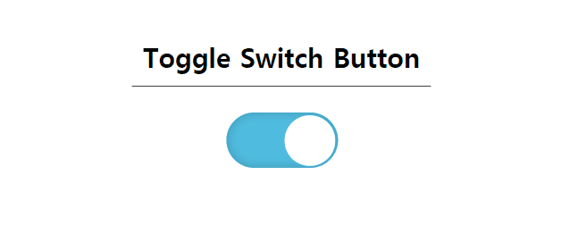

# HTML / CSS Toggle Switch Button 구현

## 프로젝트 소개
on/off기능 등에 많이 쓰이는 Toggle Switch button을 Check Box 디자인을 통한 Toggle Button 구현한다.

## 사용 언어
- HTML
- CSS

## 구현 방법
1. appearance 속성을 통하여 기본 체크 박스 모양을 없앰
2. background, border-radius등의 속성을 통해 toggle switch button의 기본 모양을 잡음
3. ::before 가상요소를 이용하여 동그라미 스위치 모양을 만들기
4. trasition으로 체크X, 체크O 동그라미 위치 변화를 움직이듯 주기

## 완성된 모습

